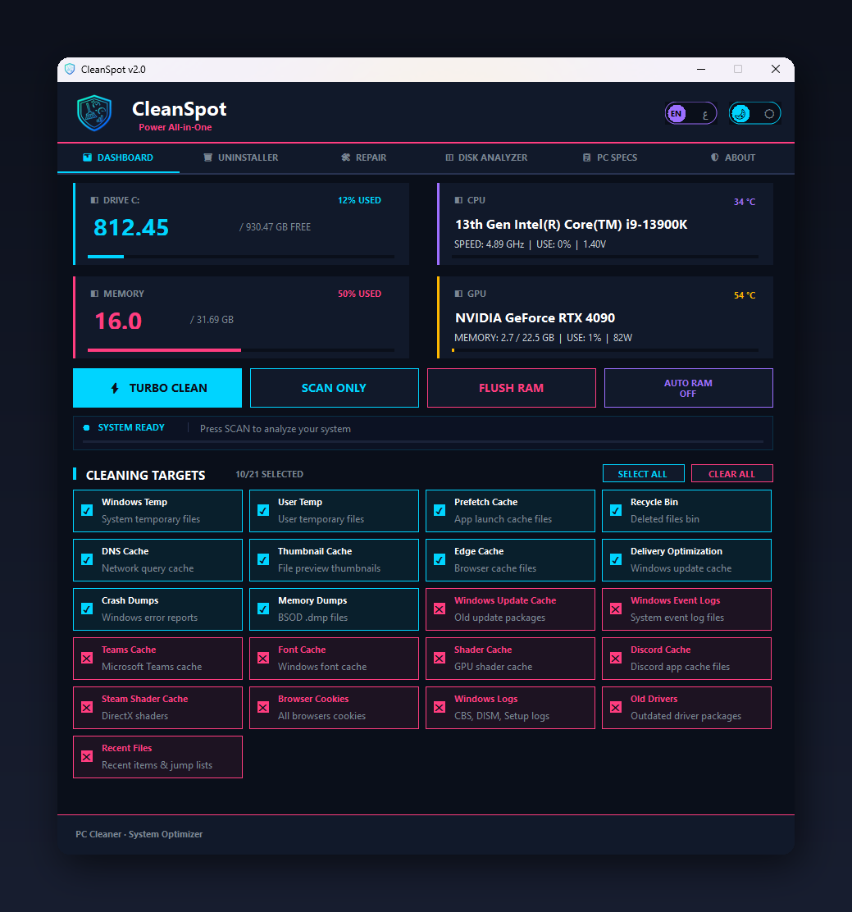

# CleanSpot

### Professional All-in-One PC Optimization Tool

**Clean your junk · See what's filling your drive · Repair Windows · Fully remove programs**

 

CleanSpot is free and always will be. If it saved you some space or headaches, you can support its development:

 

---

## Why CleanSpot?

Most cleaners just delete temp files and call it a day. CleanSpot goes further — it **shows you what's actually eating your disk**, **repairs a broken Windows install**, and **removes programs down to the last registry key**. One app, six tabs, no subscriptions, no bloat.

Built for gamers and power users. Now in **Arabic and English**.

 

## ✨ Features

| | Tool | What it does |
|---|------|--------------|
| 📊 | **Disk Analyzer** &nbsp;`NEW` | A treemap of every folder, a duplicate finder verified with full SHA-256, big-file lists, and one-click cleanup suggestions. |
| 🧹 | **System Cleaning** | Reclaim space across 21 targets — Windows Temp, browser and shader caches, crash dumps, and more. Scan first, clean only what you pick. |
| 🗑️ | **Deep Uninstaller** | Removes programs completely — files, AppData, shortcuts, services, scheduled tasks and registry keys. Waits for Steam & Epic to finish. |
| 🛠️ | **System Repair** | Run SFC and DISM with real progress and real results, plus component-store cleanup to reclaim space from old updates. |
| ⚡ | **RAM Optimization** | Free memory with one click, or let Auto RAM clean automatically past a threshold you set. |
| 📈 | **Hardware Monitor** | Live CPU, GPU, RAM and disk usage with clock speeds and temperatures. |
| 🌐 | **Arabic Interface** &nbsp;`NEW` | Full right-to-left Arabic, switchable anytime. Dark / light themes, remembered between sessions. |

 

## 🚀 Installation

1. Download **`CleanSpot_Setup_v2.0.exe`** from the [Releases page](../../releases/latest)
2. Run the installer and follow the steps
3. Launch CleanSpot from the Start Menu

> **First launch:** CleanSpot isn't code-signed yet, so Windows may show a SmartScreen warning.
> Click **More info → Run anyway** — this is expected for new, unsigned apps.

**Requirements:** Windows 10 (1809) or later, 64-bit · Administrator rights

 

## 🎯 Quick Start

1. Launch CleanSpot — it will request administrator access
2. Review the cleaning targets; common-safe ones are enabled by default
3. Click **SCAN ONLY** to preview, or **TURBO CLEAN** to clean now
4. Explore the **Disk Analyzer**, **Uninstaller** and **Repair** tabs

 

## 🛡️ Safety

- **Open source** — the released build can be reproduced from this code
- Every clean, uninstall and delete is written to a **daily log** (`%LOCALAPPDATA%\CleanSpot\logs`)
- A **system restore point** can be created before uninstalling programs
- Disk Analyzer deletes go to the **Recycle Bin**, not permanent deletion

> CleanSpot performs system-level operations including file deletion and registry changes.
> Always review your selected targets before cleaning. Deep uninstall permanently removes program data.

 

## 💛 Support

Found a bug or have an idea? [**Open an issue**](../../issues) — feedback is always welcome.

If you'd like to support development, there's a <a href="https://www.paypal.com/ncp/payment/RZPR585EB3T38" target="_blank" rel="noopener">PayPal donate button</a> at the top. Thank you 🙏

 

---

**CleanSpot** · Power All-in-One

Copyright © 2026 SPooT · All Rights Reserved

