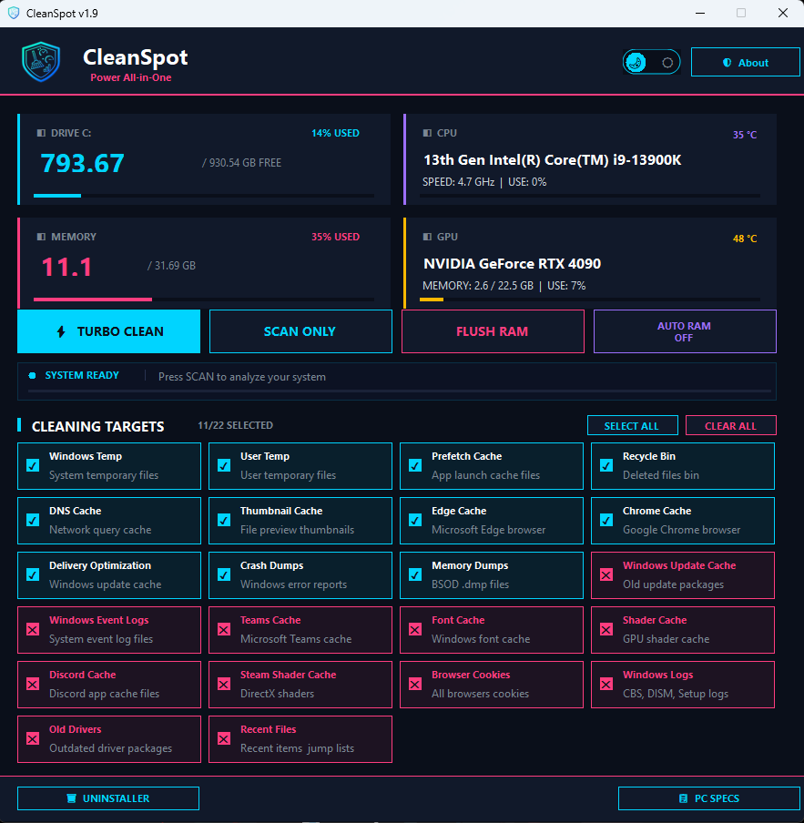

# CleanSpot

### Professional All-in-One PC Optimization Tool

Deep-clean junk files · Free up RAM · Fully remove programs · Monitor your hardware in real time

[**⬇ Download Latest Release**](../../releases/latest)

## Support

CleanSpot is free. If you find it useful, you can support its development:

  

---

## Overview

CleanSpot is a professional all-in-one PC optimization tool designed for gamers and power users. It deep-cleans junk files across 22 system targets, frees up RAM with one click, fully uninstalls programs including leftover files and registry entries, and provides real-time hardware monitoring.

## Features

### System Cleaning
Clean junk and cache files across 22 targets including Windows Temp, browser caches, shader caches, crash dumps, memory dumps, Delivery Optimization files, and more. Scan first to see how much space you can reclaim, then clean only what you select.

### RAM Optimization
Free up memory instantly with one click. Optional Auto RAM mode monitors usage and automatically cleans memory when it crosses a threshold you choose.

### Deep Uninstaller
Remove programs completely, not just the main files. The deep uninstall process runs the program's own uninstaller, then removes residual files, AppData folders, Start Menu shortcuts, scheduled tasks, related services, and registry entries.

### Hardware Monitoring
Real-time monitoring of CPU, GPU, RAM, and disk usage, including live clock speeds and temperatures.

### Dark / Light Theme
Switch between dark and light modes anytime. Your preference is remembered.

## System Requirements

- Windows 10 or Windows 11 (64-bit)
- Administrator privileges (required for system cleaning operations)

## Installation

1. Download CleanSpot_Setup_v1.9.1.exe` from the [Releases page](../../releases/latest)
2. Run the installer and follow the steps
3. Launch CleanSpot from the Start Menu

### First-Run Notice

CleanSpot is not yet code-signed, so Windows SmartScreen may show a warning on first launch:

1. Click **More info**
2. Click **Run anyway**

This is expected for unsigned applications. You can verify the file is safe using the VirusTotal link below.

## Security
VirusTotal scan: **0/70 — clean** ([view report](https://www.virustotal.com/gui/file/31565484f6766a698ab08d2cde0913e24f81ede95f867f1e03ddfc3f193f4be5?nocache=1))

SHA-256:
`55bc6f1b119bf31aae0df584453a65b115d90c1cc0526a7bec9ceb5d97c3425a`

## Usage

1. Launch CleanSpot (it will request administrator access)
2. Review the cleaning targets — eight common-safe targets are enabled by default
3. Click **SCAN ONLY** to see reclaimable space, or **TURBO CLEAN** to clean immediately
4. Use **FLUSH RAM** to free memory, or the footer buttons for the Uninstaller and PC Specs

## Disclaimer

CleanSpot performs system-level operations including file deletion and registry modification. While designed to be safe, always review your selected targets before cleaning. The deep uninstall feature permanently removes program data and cannot be undone. Use at your own discretion.

---

**CleanSpot** · Power All-in-One

Copyright © 2026 SPooT · All Rights Reserved

